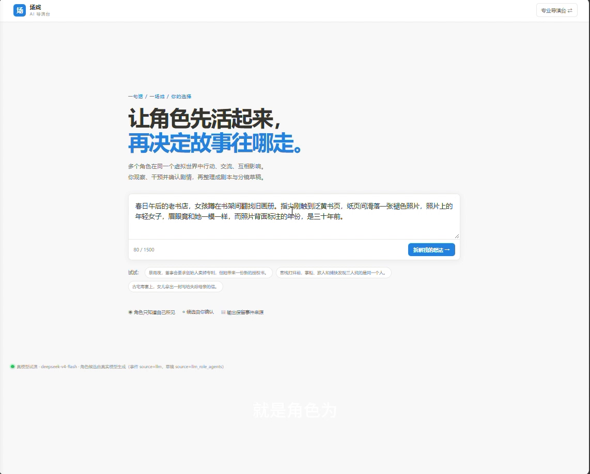
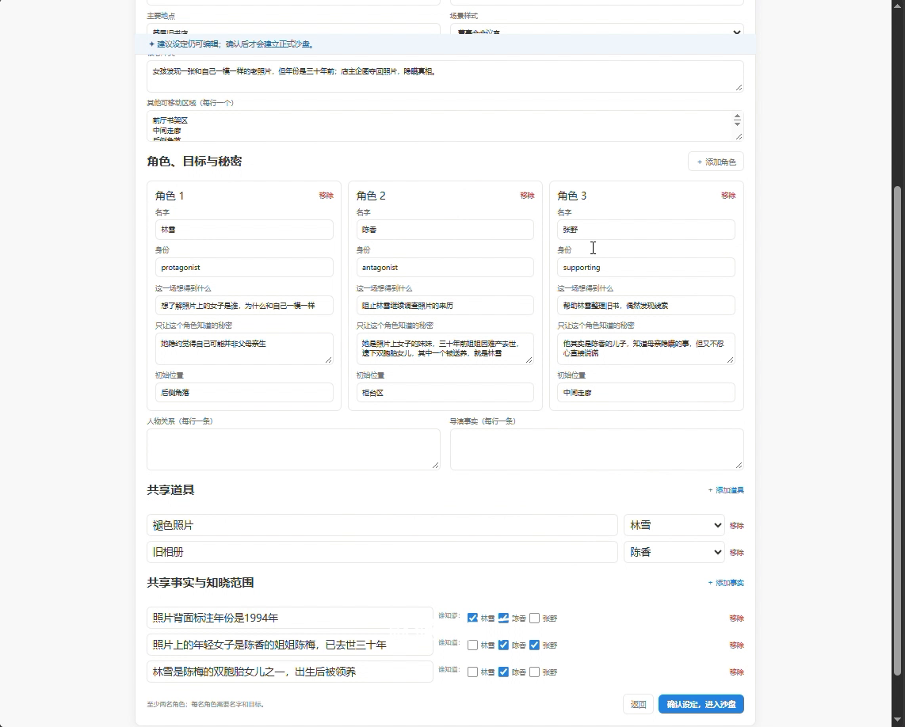
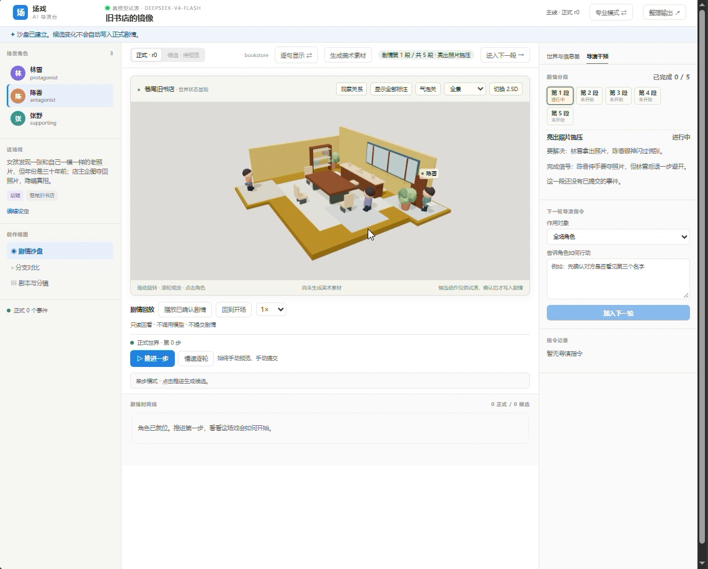
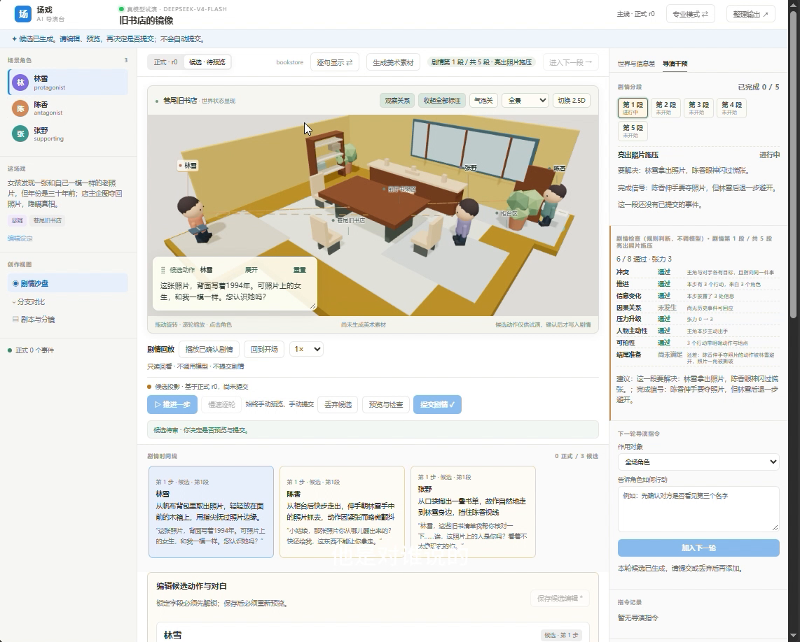
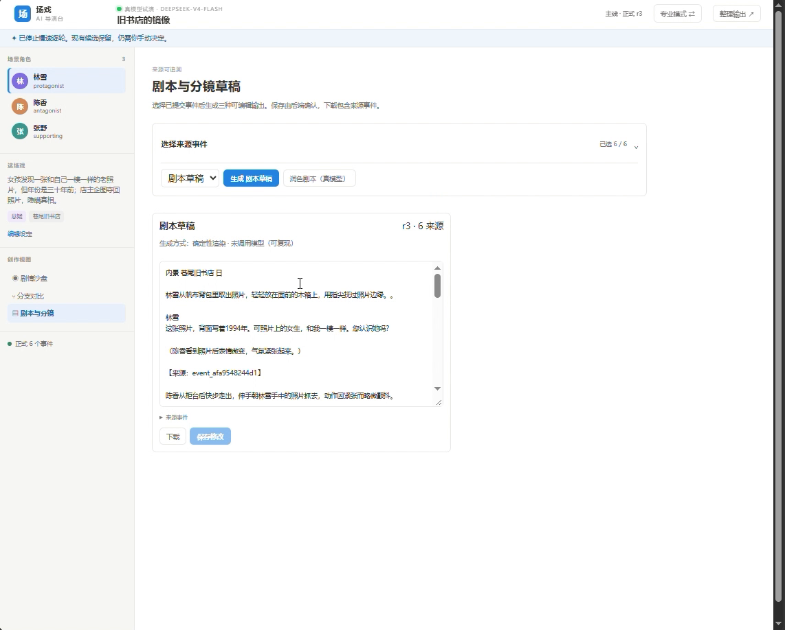
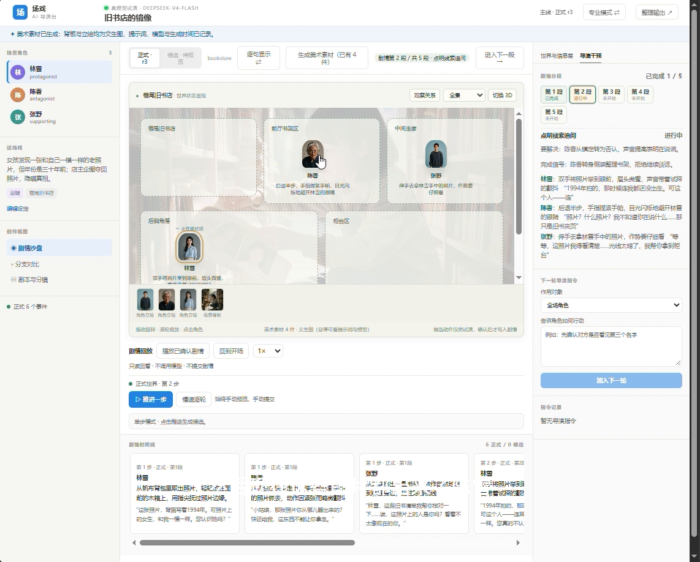

# 可视化 AI 导演台（场戏）

> 让角色先活起来，再决定故事往哪走。

从一句话想法开始，让多个角色在共享虚拟世界中**同时行动、交流、观察、互相影响**；你查看候选、编辑、干预并确认，系统再整理出**场次卡、剧本与分镜草稿**。

3D / 2.5D 舞台是剧情状态的实时显现，不是预制动画。

---

## 界面一览

**① 开场：一句话想法**



**② 配置角色：目标、秘密与立场**



**③ 3D 沙盘：共享世界全景**



**④ 角色对话：气泡指向对话对象**



**⑤ 剧本与分镜草稿（每段标注来源事件）**



**⑥ 美术素材：场景背板与角色立绘**



---

## 快速开始（Windows PowerShell）

需要 Python 3.13（含 py 启动器）与 Node.js 18+。在项目目录打开 PowerShell：

```powershell
./start.ps1
```

依赖会安装到项目目录（`backend/.depsclean`、`web/node_modules`），**不修改全局 Python**。离线演示不需要 API Key。

启动后访问：

- 导演台　：<http://127.0.0.1:5274/>
- 健康检查：<http://127.0.0.1:8200/health>
- API 文档：<http://127.0.0.1:8200/docs>

停止服务：

```powershell
./stop.ps1
```

> 脚本会核对端口、登记进程身份；端口被未登记进程占用时直接报错。日志在 `.runtime/` 下。`./start.ps1 -SkipInstall` 可禁止自动安装。

---

## 它是怎么运转的

```text
一句话想法
   │  expand（live 模型严格 JSON / 离线确定性规则，来源可见）
   ▼
完整设定 + 舞台 manifest（角色 / 区域 / 道具 / 事实 / 配色 / 坐标）
   ▼
角色 Agent 同时提出候选（每个角色只拿到自己视角下的信息）
   ▼
世界统一仲裁（在副本上）：移动邻接 · 道具状态 · 事实披露 · 见证关系
   ▼
候选 → 预览 → 你编辑 / 干预 → 提交（乐观锁 · 幂等 · 字段锁）
   ▼
场次卡 + 剧本 + 分镜草稿（每段标注来源事件 ID）
   ▼
3D / 2.5D 舞台实时显现
```

作者始终掌握控制权：可以**手动推进、下指令干预、开分支、回放**。

---

## 场景与美术

**场景即配置，无需为每个题材写代码：**

- `scene_manifests/*.json` 内置董事会 / 办公室 / 客栈 / 古宅 / 通用等舞台；
- 开场生成的 manifest 会覆盖内置值（配色、区域坐标、道具、相机、交互点）；
- 舞台按形态渲染——室内 / 室外 / 载具 / 街景 / 矿洞，不属于该形态的零件不会出现；
- 扩展方式见 [场景配置说明](docs/SCENE_MANIFEST.md)。

**美术层按需触发生成（文生图），只做视觉、不参与剧情裁决：**

| 类型 | 默认尺寸 | 提示词来源 |
|---|---|---|
| 场景背板 | 1024×1024 | 地点与环境（无人全景） |
| 角色立绘 | 864×1152 | 外形 + 公开身份 |
| 道具参考 | 1024×1024 | 道具特写 |

图片落在 `data/assets/`，每张记录提示词、模型、尺寸与 sha256；生成失败显式报错，不返回占位假图。

---

## 运行模式：live / offline

当前模式始终显示在界面徽标上，不会把离线规则说成模型生成。

| 模式 | 生成方式 | 来源标记 | 生效条件 |
|---|---|---|---|
| `live` | 真实模型（OpenAI 兼容，默认 DeepSeek） | `llm` | 指定 live 且有密钥 |
| `offline` | 本地确定性规则 | `offline_rule_v1` | 指定 offline，或无密钥 |

- 解析顺序：显式指定 > 环境变量 `DIRECTOR_MODEL_MODE` > 自动（有密钥 live / 无密钥 offline）；
- **显式 live 但缺密钥会拒绝启动**，不静默降级；
- 密钥只从环境变量或 `.env` 读取（`.env` 已被 gitignore，绝不上传）；`GET /api/v1/runtime` 不返回密钥。

---

## 手动运行与验证

后端：

```powershell
$env:PYTHONPATH = (Resolve-Path backend/.depsclean).Path
py -3.13 -m uvicorn api.app:app --app-dir . --host 127.0.0.1 --port 8200
```

前端（另开一个终端）：

```powershell
cd web
npm ci
npm run dev -- --host 127.0.0.1 --port 5274 --strictPort
```

测试与构建：

```powershell
py -3.13 -m pytest -q backend/tests
cd web
npm run build
```

---

## 项目结构

- `backend/`　：FastAPI 服务与剧情核心（`director_core`）
- `web/`　　：React + TypeScript + Vite 导演台（three.js）
- `scene_manifests/`：自动加载的场景配置
- `docs/`　　：来源、复用边界、第三方许可、验收清单与界面截图
- `start.ps1` / `stop.ps1`：本地运行脚本

剧情核心独立版本化，运行时不导入旧平台，也不包含旧平台的长篇、章节、风格档案等模块。

---

## 交付状态

世界状态与草稿保存在 `data/director.db`（可用 `DIRECTOR_DB` 指定）；正常启停不会删除。

- 后端 `70 passed`；前端 `npm run build` 通过；
- live 模式一次 3 角色生成约 4.8 秒，事件与草稿分别标记来源；
- 预览不改正式状态，提交后版本递增，重复提交幂等；
- 美术素材实跑通过（背板 / 立绘均带提示词、模型与时间戳）。

详见 [验收记录](docs/ACCEPTANCE.md)。
